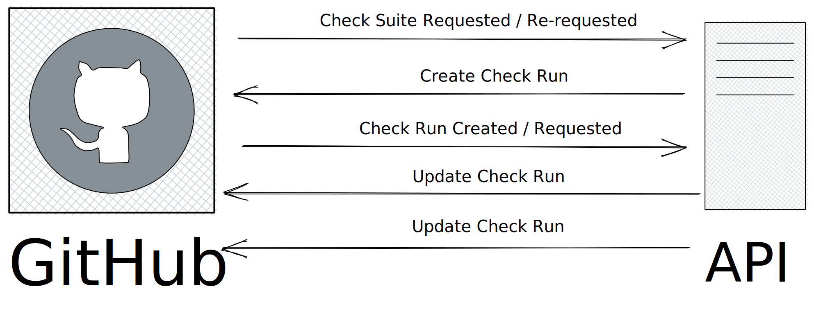

# github checks

<!-- markdownlint-disable MD033 -->

<!-- markdownlint-enable MD033 -->

Check suite requested is generated per commit, not per pr. This means if you create a new pr for the exact same commit, the check suite will be the same.
