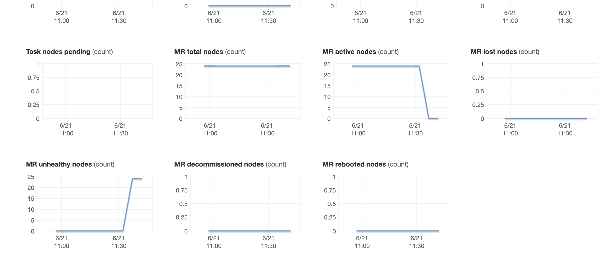

# Spark EMR Troubleshooting

## Job aborted, or SparkContext was shut down

eg:
```
An error occurred while calling o147.parquet.
: org.apache.spark.SparkException: Job aborted.
....
Caused by: org.apache.spark.SparkException: Job 3 cancelled because SparkContext was shut down
```

This general error message doesn't tell you much. To understand more, inspect the Spark UI and/or logs.

## Container released on a lost node.

These appear in the Spark UI for a task, eg:
```
ExecutorLostFailure (executor 29 exited unrelated to the running tasks) Reason: Container marked as failed:
container_1583201437244_0001_01_000030 on host: ip-10-97-44-35.ec2.internal. Exit status: -100.
Diagnostics: Container released on a *lost* node.
```	
This generic error message means there was YARN node failure, and so YARN stopped the container containing the Spark executor. It does not indicate the root cause. To diagnose further [check the YARN node manager logs](#Check-the-YARN-node-manager-logs).

## EC2 is out of capacity

This occurs where there an not enough available EC2 instances in the availability zone.

Either
* change availability zone
* change instance type
* if using spot instances, switch to using on-demand 

## Unhealthy Nodes

The YARN Nodemanager [Health Checker Service](https://hadoop.apache.org/docs/current/hadoop-yarn/hadoop-yarn-site/NodeManager.html#Health_Checker_Service) determines the health of nodes. The default health checkmeasures disk space and if the disk becomes more than 90% full the node will be marked as unhealthy. An unhealthy node will have its containers killed and won't be assigned new containers.

This AWS console graph shows all nodes have been unhealthy, and are no longer active:  



For resolutions, see [Fix disk space](#Fix-disk-space)

## Executor is not registered

The external shuffle service is a long running process required for dynamic allocation. The service serves shuffle files from an executor beyond its lifetime.

If the shuffle service is killed and restarted, it can lose its list of registered executors.
When this happens you will see these errors on the spark driver:
```
org.apache.spark.shuffle.FetchFailedException: Failure while fetching StreamChunkId{streamId=1573317867797, chunkIndex=0}: 
 java.lang.RuntimeException: Executor is not registered
```

And these errors in the shuffle service logs:
```
org.apache.spark.network.server.TransportRequestHandler (shuffle-server-2-29): Error opening block StreamChunkId{streamId=596585941509, chunkIndex=8} for request from /10.97.36.245:34460
 java.lang.RuntimeException: Executor is not registered
```

YARN kills the shuffle service when there is a disk failure (ie: out of disk space). Disk failures are usually the cause, and *Executor is not registered* is a symptom.

For more info see
* [Graceful Decommission of Executors](https://spark.apache.org/docs/latest/job-scheduling.html#graceful-decommission-of-executors)
* [SPARK-27736](https://issues.apache.org/jira/browse/SPARK-27736)

## Check the YARN node manager logs

EMR stores all cluster logs at the _Log URI_ specified during cluster creation. Both the _Log URI_ and the _Cluster ID_ are visible from the EMR cluster **Summary** tab.

To fetch the YARN node logs given a `LOG_URI` and `CLUSTER_ID`:
```
aws s3 cp --recursive "${LOG_URI}/${CLUSTER_ID}/node/" . 
```

The most common cause of node failure is disk failure (ie: running out of disk space). To search for this error condition:
```
zgrep -R "disks failed" *
```

If the node has run out of disk you'll see errors like:

```
2018-02-13 22:19:13,972 WARN org.apache.hadoop.yarn.server.nodemanager.DirectoryCollection (DiskHealthMonitor-Timer): Directory /mnt/yarn error, used space above threshold of 90.0%, removing from list of valid directories
2018-02-13 22:19:13,972 WARN org.apache.hadoop.yarn.server.nodemanager.DirectoryCollection (DiskHealthMonitor-Timer): Directory /var/log/hadoop-yarn/containers error, used space above threshold of 90.0%, removing from list of valid directories
2018-02-13 22:19:13,972 INFO org.apache.hadoop.yarn.server.nodemanager.LocalDirsHandlerService (DiskHealthMonitor-Timer): Disk(s) failed: 1/2 local-dirs are bad: /mnt/yarn; 1/1 log-dirs are bad: /var/log/hadoop-yarn/containers
2018-02-13 22:19:13,972 ERROR org.apache.hadoop.yarn.server.nodemanager.LocalDirsHandlerService (DiskHealthMonitor-Timer): Most of the disks failed. 1/2 local-dirs are bad: /mnt/yarn; 1/1 log-dirs are bad: /var/log/hadoop-yarn/containers
```

## Fix disk space

1. Try to [increase disk space](#increase-disk-space)
1. Check for imbalanced partitions/data skew via the [SQL Tab](#SQL-Tab) and repartition the dataset in a more balanced way.

### SQL Tab

The SQL tab will show you the DAG visualisation at the top, and the query plan at the bottom. As you hover over nodes in the DAG you can see the query plan for that node. Exchange nodes will show the data sizes, and Sort nodes will show spill sizes, which can help identify skew, eg:

```
Exchange
data size total (min, med, max): 
2.6 TB (478.1 MB, 679.5 MB, 5.5 GB)

Sort
sort time total (min, med, max): 
7.7 m (12 ms, 255 ms, 35.3 s)
peak memory total (min, med, max): 
502.4 GB (64.1 MB, 456.0 MB, 10.8 GB)
spill size total (min, med, max): 
2.3 TB (0.0 B, 0.0 B, 221.8 GB
```

### Increase disk space

The easiest way to increase disk space on EMR is by choosing a large instance type. See this [Instance Storage](https://docs.aws.amazon.com/emr/latest/ManagementGuide/emr-plan-storage.html) guide which shows the amount of disk provided by each instance type.

The other way to increase disk space is to modify the EBS storage defaults when creating a cluster.
